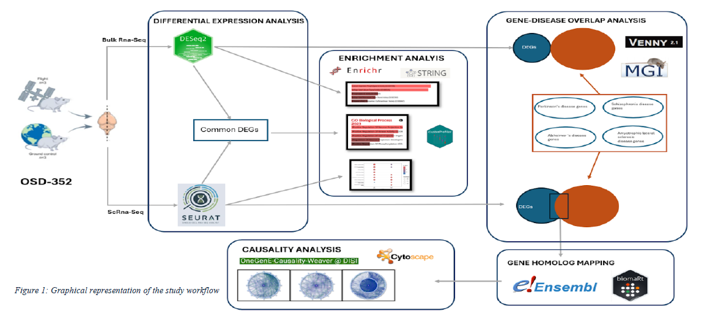

# Causal Network Analysis of Space-Induced Neurodegeneration in Mice with Human Gene Mapping
### _Deep Analysis of Space-Omics_

---
## Frederick , FAC, Abi Chahine
> M.Sc. in Quantitative & Computational Biology, University of Trento, Italy
## Hala, HA, Alshaar
> M.Sc. in Quantitative & Computational Biology, University of Trento, Italy 
## Caterina, CS, Sanetti
> M.Sc. in Quantitative & Computational Biology, University of Trento, Italy

---

## Abstract
Neurological health faces special obstacles during spaceflight. To investigate space-induced neurodegeneration, this study examines gene expression data from the Rodent Research-3 mission. Significant differences in gene expression between spaceflight and ground control conditions were found by the analysis of bulk and single-cell RNA sequencing of mouse brain tissue. Dysregulation of MAPK signaling and synaptic pathways was discovered by functional enrichment analysis. Significant overlap was discovered between genes linked to major neurodegenerative diseases, namely Schizophrenia and Alzheimer's disease, and genes that are differentially expressed during spaceflight. Key genes such as GNAO1, AKAP6, and KCNC1 were found by causality analysis, indicating biological pathways through which spaceflight may affect neurodegeneration. These results offer information for creating preventative strategies to safeguard astronauts' neurological well-being on extended space flights.

## Introduction
Human spaceflight introduces unique challenges to the body, particularly to both the immune and neurological systems. Extended exposure to isolation, microgravity, radiation, disrupted nutrition, and circadian rhythm changes significantly stresses astronauts during missions to the International Space Station (ISS) and future interplanetary travel. These factors can negatively affect astronaut health, so understanding and mitigating their effects is vital for the health and performance of crew members on long-duration missions [16]. Space missions present multiple risks, including radiation exposure, bone density loss, muscle atrophy, and vision problems. Space medicine focuses on addressing these challenges. For example, Wang et al. [27] explored Spaceflight-Associated Neuro-Ocular Syndrome (SANS), a condition that causes visual and neurological changes in astronauts. This highlights the need to develop effective countermeasures, especially for long-term conditions like SANS. Studies have also shown that changes in gravity affect brain function. Van Ombergen et al. [25] studied how altered gravity during parabolic flights impacts brain connectivity. They found reduced connectivity in regions such as the right angular gyrus (rAG) and right temporoparietal junction (rTPJ), which are crucial for sensory integration, balance, vision, and proprioception. Their results suggested that spaceflight can disrupt self-monitoring and attention regulation by affecting brain regions that help integrate sensory information, highlighting how gravity changes can alter the brain’s ability to process and react to sensory input. After long spaceflights, astronauts often experience both structural and functional changes in their brains, particularly in areas responsible for motor and cognitive functions. Roberts et al. [20] linked these changes to shifts in bodily fluids and the absence of gravity, as observed in MRI studies. These alterations can have significant implications for astronaut health, underscoring the need to understand the underlying mechanisms and develop strategies to protect brain health during extended space missions.  

Despite progress in space-related research, the molecular processes behind the brain changes astronauts experience during spaceflight are still not fully understood. Van Ombergen et al. [26] pointed out the need for more research to explore how these physiological shifts impact brain function and overall astronaut well-being. To fill this gap, the current study aims to investigate the causes of space-induced neurodegeneration and its implications for human health by analyzing brain samples from the Rodent Research-3 (RR-3) mission [14]. By comparing mice flown to the ISS with ground-based controls, methods like mRNA transcriptomics and single-cell RNA sequencing will be used to look closely at gene expression. This approach will investigate causal relationships between spaceflight exposure and neurodegenerative diseases by analyzing molecular-level changes, as depicted in Figure 1.  

## Materials & Methods

> 1. Data & Data Collection

The foundation of our research relies on gene expression data accessed through NASA's Open Science Data Repository, drawing specifically from dataset OSD-352 [14]. Our study examines detailed gene expression patterns observed in female mice brain tissue, comparing individuals exposed to spaceflight conditions with their earthbound counterparts. Working with a focused sample size, this study analyzed six female mice, evenly split between those experiencing spaceflight conditions and those maintained as ground controls. The OSD-352 dataset was selected as it offers a rare window into how spaceflight affects gene expression in mammals. The repository provides both unprocessed sequence information and refined gene expression matrices, allowing us to conduct thorough comparisons between space-exposed and control groups. What particularly strengthens our research is NASA's commitment to rigorous data quality standards and open science practices, which ensure our findings can be independently verified and built upon by other researchers. One major strength of this dataset is its dual approach to RNA sequencing. A multidimensional perspective of gene expression changes was obtained by combining bulk RNA sequencing for larger tissue analysis with single-cell RNA sequencing for more detailed insights.

>> 1.1. Bulk RNA-Seq

Transcriptomic profiling for this study was conducted using publicly available data from the OSD-352 dataset, namely from the RR-3 experiment by NASA. The analysis utilized the unnormalized count matrix provided in the dataset, titled GLDS-352_rna_seq_STAR_Unnormalized_Counts.csv. This raw count data matrix represents mRNA expression levels in mice brain samples across experimental conditions [14].

>> 1.2. Single Cell RNA-Seq

The single-cell RNA-seq (scRNA-seq) data utilized in this study was obtained from the publicly available dataset accompanying the study "Spatially Resolved Multi-omics on the Neuronal Effects Induced by Spaceflight in Mice" [15]. The dataset, provided as a preprocessed multimodal Seurat object, included scRNA-seq and ATAC sequencing (scATAC-seq) data of mice brain samples. The Seurat object was used as it is, with no additional normalization or preprocessing applied to the RNA data prior to differential gene expression analysis.

>> 1.3. Disease Genes

Disease-associated genes for overlap analysis were downloaded from the Mouse Genomics Informatics (MGI) database [3]. Specifically, DOID:10652 for Alzheimer's Disease (AD), DOID:5419 for Schizophrenia (SCZ), DOID:332 for Amyotrophic Lateral Sclerosis (ALS), and DOID:14330 for Parkinson’s Disease (PD). These genes were used to test for overlap with the list of differentially expressed genes (DEGs) identified between the spaceflight and ground conditions.

> 2. Differential Gene Expression Analysis

>> 2.1. Analysis of Bulk RNA-Seq Data

The differential expression analysis was performed using the unnormalized count matrix [14], and preprocessing involved filtering genes expressed in at least 25% of the samples and transforming the data into log2(counts + 1) for quality control and visualization. The analysis was conducted using the DESeq2 package (version 1.46.0) in R [13], with experimental conditions defined as "Case" (samples containing 'F' for flight) and "Control" (samples containing 'G' for ground). Genes were considered differentially expressed if they met the criteria of a p-value < 0.05 and an absolute log2 fold change (|LFC|) ≥ 0.5. Quality control steps included visualizing expression density distributions, sample correlation heatmaps, and gene variability based on mean expression and coefficient of variation. The final outputs, including the ranked list of DEGs and processed count data, were saved for downstream analyses.

>> 2.2. Analysis of Single Cell RNA-Seq Data

On scRNA-seq, differential gene expression analysis was performed using the Seurat R package (version 5.1) [10]. The analysis was conducted to identify genes differentially expressed between two conditions: "flight" and "ground". The preprocessed multimodal Seurat object (Seurat_Multi), which included both RNA sequencing and ATAC sequencing data, was configured to utilize the RNA sequencing data for this analysis [15]. The RNA data had already undergone normalization and preprocessing, and no additional normalization steps were applied. Specifically, the default assay for the Seurat object was set to "RNA" to ensure that the raw, normalized gene expression counts were used. Differential gene expressions were computed using the FindMarkers() function in Seurat, employing the Wilcoxon rank-sum test [10]. The analysis compared gene expression directly between all cells from the "flight" condition (ident.1) and the "ground" condition (ident.2), independent of their cluster assignment. Only genes expressed in at least 30 % of the cell were retained and genes with log2fold change > 0.50, where considered differentially expressed. Genes were further filtered based on statistical significance, with an adjusted p-value threshold of 0.05. A total of 894 DEGs were identified between the two conditions.

> 3. Functional Enrichment Analysis

To investigate the biological processes, molecular functions, and cellular components associated with the DEGs, Gene Ontology (GO) enrichment analysis was performed [2]. For scRNA-seq, clusterProfiler package (version 4.14.3) in R was used [29]. The list of DEGs was used as input into the analysis, and gene symbols as identifiers. The GO enrichment analysis was conducted using the enrichGO() function from the clusterProfiler package, with the org.Mm.eg.db database for mapping mouse gene symbols to GO terms [2]. While bulk RNA-seq enrichment analysis was performed using the EnrichR tool, the DEGs from differential expression analysis of bulk RNA-seq data were submitted to the EnrichR platform, which returned enriched terms based on curated datasets [8]. In addition to the GO enrichment analysis, disease enrichment analysis was conducted to explore potential gene-disease associations. This analysis was carried out using CTD Set Analyzer, a resource that integrates data on genes, diseases, and chemical interactions from scientific literature [4]. The list of DEGs coming from the differential expression analysis of scRNA-seq was submitted to the CTD Set Analyzer tool, which performed enrichment analysis to identify diseases that were overrepresented in the gene list.

> 4. Network Visualization

To investigate the relationships between upregulated and downregulated DEGs, network visualization was performed using the STRING database [23]. STRING is a resource for identifying protein-protein interactions (PPIs), helping to understand the functional relationships between genes. Separate networks were constructed for upregulated and downregulated genes, with interactions retrieved from STRING.

> 5. Gene-Disease Overlap Analysis

To explore potential associations between the DEGs and known disease-related genes, an overlap analysis was conducted. This procedure aimed to identify genes that were shared between the DEGs and disease-related gene sets, using Fisher’s Exact Test to give a statistical significance measure to the overlap [21]. The common genes between the DEGs and the disease-related genes were identified using basic set operations. These common genes were considered as potential candidates for further investigation into gene-disease relationships. The overlap between the two gene sets was visualized using the ggVennDiagram() function from the ggplot2 package (version 3.5.1) in R [28].

> 6. Mouse to Human Gene Homology

To bridge the findings between mouse models and human implications, this study implemented a systematic approach for converting mouse genes to their human homologs. Our methodology leveraged the Ensembl BioMart database, accessing it through programmatic queries via their REST API [1]. This conversion encompassed our complete set of DEGs, derived from both bulk RNA-seq and scRNA-seq analyses. The conversion framework prioritized accuracy by incorporating orthology confidence scores, ensuring reliable gene mapping between species. Through the Ensembl platform, comprehensive mouse-to-human gene name correspondences were obtained, meticulously documenting cases where human homologs were unavailable. Our quality control process tracked successful conversions, missing homologs, and confidence levels of the mapped genes, maintaining transparency throughout the analytical pipeline [1]. This crucial homology mapping step served as a bridge between our experimental findings in mouse models and their potential human applications. The resulting human gene identifiers were systematically documented and integrated into our subsequent analyses, maintaining clear traceability between species-specific gene annotations throughout our investigation.

> 7. Causality Analysis

An analysis of causal relationships between disease-associated genes and DEGs was performed using the OneGenE Causality Weaver platform [6]. The causality networks were generated using strict parameter controls - OneGenE relative frequency thresholds ranged from 0.95 to 1.0, alongside Pearson correlation thresholds set between 0.2 and 1.0. These networks, exported as JSON files, underwent further processing in Cytoscape for detailed examination of causal gene relationships [11]. Upon extracting gene labels from these networks in Cytoscape, a meticulous cross-referencing process against original DEGs revealed overlapping genes, visualized through Venn diagrams [11]. To understand the broader implications, a frequency distribution plot was created by combining gene overlaps across diseases, highlighting crucial DEGs involved in multiple disease-related causal pathways. Building upon this analysis, an additional frequency plot mapped the distribution of disease genes across all four neurological conditions (AD, SCZ, ALS, and PD), shedding light on genes potentially involved in multiple disease mechanisms. This detailed mapping of causal relationships offered valuable insights into how spaceflight-induced changes in gene expression might influence disease-relevant cellular processes, establishing potential mechanistic links between spaceflight exposure and neurological disease pathways.