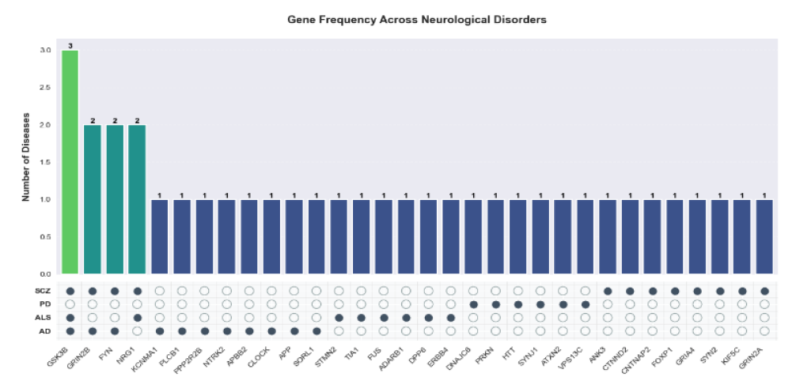

# Causal Network Analysis of Space-Induced Neurodegeneration in Mice with Human Gene Mapping
### _Deep Analysis of Space-Omics_

---
## Frederick , FAC, Abi Chahine
> M.Sc. in Quantitative & Computational Biology, University of Trento, Italy
## Hala, HA, Alshaar
> M.Sc. in Quantitative & Computational Biology, University of Trento, Italy 
## Caterina, CS, Sanetti
> M.Sc. in Quantitative & Computational Biology, University of Trento, Italy

---

## Abstract
Neurological health faces special obstacles during spaceflight. To investigate space-induced neurodegeneration, this study examines gene expression data from the Rodent Research-3 mission. Significant differences in gene expression between spaceflight and ground control conditions were found by the analysis of bulk and single-cell RNA sequencing of mouse brain tissue. Dysregulation of MAPK signaling and synaptic pathways was discovered by functional enrichment analysis. Significant overlap was discovered between genes linked to major neurodegenerative diseases, namely Schizophrenia and Alzheimer's disease, and genes that are differentially expressed during spaceflight. Key genes such as GNAO1, AKAP6, and KCNC1 were found by causality analysis, indicating biological pathways through which spaceflight may affect neurodegeneration. These results offer information for creating preventative strategies to safeguard astronauts' neurological well-being on extended space flights.

## Introduction
Human spaceflight introduces unique challenges to the body, particularly to both the immune and neurological systems. Extended exposure to isolation, microgravity, radiation, disrupted nutrition, and circadian rhythm changes significantly stresses astronauts during missions to the International Space Station (ISS) and future interplanetary travel. These factors can negatively affect astronaut health, so understanding and mitigating their effects is vital for the health and performance of crew members on long-duration missions [16]. Space missions present multiple risks, including radiation exposure, bone density loss, muscle atrophy, and vision problems. Space medicine focuses on addressing these challenges. For example, Wang et al. [27] explored Spaceflight-Associated Neuro-Ocular Syndrome (SANS), a condition that causes visual and neurological changes in astronauts. This highlights the need to develop effective countermeasures, especially for long-term conditions like SANS. Studies have also shown that changes in gravity affect brain function. Van Ombergen et al. [25] studied how altered gravity during parabolic flights impacts brain connectivity. They found reduced connectivity in regions such as the right angular gyrus (rAG) and right temporoparietal junction (rTPJ), which are crucial for sensory integration, balance, vision, and proprioception. Their results suggested that spaceflight can disrupt self-monitoring and attention regulation by affecting brain regions that help integrate sensory information, highlighting how gravity changes can alter the brain’s ability to process and react to sensory input. After long spaceflights, astronauts often experience both structural and functional changes in their brains, particularly in areas responsible for motor and cognitive functions. Roberts et al. [20] linked these changes to shifts in bodily fluids and the absence of gravity, as observed in MRI studies. These alterations can have significant implications for astronaut health, underscoring the need to understand the underlying mechanisms and develop strategies to protect brain health during extended space missions.  

Despite progress in space-related research, the molecular processes behind the brain changes astronauts experience during spaceflight are still not fully understood. Van Ombergen et al. [26] pointed out the need for more research to explore how these physiological shifts impact brain function and overall astronaut well-being. To fill this gap, the current study aims to investigate the causes of space-induced neurodegeneration and its implications for human health by analyzing brain samples from the Rodent Research-3 (RR-3) mission [14]. By comparing mice flown to the ISS with ground-based controls, methods like mRNA transcriptomics and single-cell RNA sequencing will be used to look closely at gene expression. This approach will investigate causal relationships between spaceflight exposure and neurodegenerative diseases by analyzing molecular-level changes, as depicted in Figure 1.  

## Materials & Methods

> 1. Data & Data Collection

The foundation of our research relies on gene expression data accessed through NASA's Open Science Data Repository, drawing specifically from dataset OSD-352 [14]. Our study examines detailed gene expression patterns observed in female mice brain tissue, comparing individuals exposed to spaceflight conditions with their earthbound counterparts. Working with a focused sample size, this study analyzed six female mice, evenly split between those experiencing spaceflight conditions and those maintained as ground controls. The OSD-352 dataset was selected as it offers a rare window into how spaceflight affects gene expression in mammals. The repository provides both unprocessed sequence information and refined gene expression matrices, allowing us to conduct thorough comparisons between space-exposed and control groups. What particularly strengthens our research is NASA's commitment to rigorous data quality standards and open science practices, which ensure our findings can be independently verified and built upon by other researchers. One major strength of this dataset is its dual approach to RNA sequencing. A multidimensional perspective of gene expression changes was obtained by combining bulk RNA sequencing for larger tissue analysis with single-cell RNA sequencing for more detailed insights.

>> 1.1. Bulk RNA-Seq

Transcriptomic profiling for this study was conducted using publicly available data from the OSD-352 dataset, namely from the RR-3 experiment by NASA. The analysis utilized the unnormalized count matrix provided in the dataset, titled GLDS-352_rna_seq_STAR_Unnormalized_Counts.csv. This raw count data matrix represents mRNA expression levels in mice brain samples across experimental conditions [14].

>> 1.2. Single Cell RNA-Seq

The single-cell RNA-seq (scRNA-seq) data utilized in this study was obtained from the publicly available dataset accompanying the study "Spatially Resolved Multi-omics on the Neuronal Effects Induced by Spaceflight in Mice" [15]. The dataset, provided as a preprocessed multimodal Seurat object, included scRNA-seq and ATAC sequencing (scATAC-seq) data of mice brain samples. The Seurat object was used as it is, with no additional normalization or preprocessing applied to the RNA data prior to differential gene expression analysis.

>> 1.3. Disease Genes

Disease-associated genes for overlap analysis were downloaded from the Mouse Genomics Informatics (MGI) database [3]. Specifically, DOID:10652 for Alzheimer's Disease (AD), DOID:5419 for Schizophrenia (SCZ), DOID:332 for Amyotrophic Lateral Sclerosis (ALS), and DOID:14330 for Parkinson’s Disease (PD). These genes were used to test for overlap with the list of differentially expressed genes (DEGs) identified between the spaceflight and ground conditions.

> 2. Differential Gene Expression Analysis

>> 2.1. Analysis of Bulk RNA-Seq Data

The differential expression analysis was performed using the unnormalized count matrix [14], and preprocessing involved filtering genes expressed in at least 25% of the samples and transforming the data into log2(counts + 1) for quality control and visualization. The analysis was conducted using the DESeq2 package (version 1.46.0) in R [13], with experimental conditions defined as "Case" (samples containing 'F' for flight) and "Control" (samples containing 'G' for ground). Genes were considered differentially expressed if they met the criteria of a p-value < 0.05 and an absolute log2 fold change (|LFC|) ≥ 0.5. Quality control steps included visualizing expression density distributions, sample correlation heatmaps, and gene variability based on mean expression and coefficient of variation. The final outputs, including the ranked list of DEGs and processed count data, were saved for downstream analyses.

>> 2.2. Analysis of Single Cell RNA-Seq Data

On scRNA-seq, differential gene expression analysis was performed using the Seurat R package (version 5.1) [10]. The analysis was conducted to identify genes differentially expressed between two conditions: "flight" and "ground". The preprocessed multimodal Seurat object (Seurat_Multi), which included both RNA sequencing and ATAC sequencing data, was configured to utilize the RNA sequencing data for this analysis [15]. The RNA data had already undergone normalization and preprocessing, and no additional normalization steps were applied. Specifically, the default assay for the Seurat object was set to "RNA" to ensure that the raw, normalized gene expression counts were used. Differential gene expressions were computed using the FindMarkers() function in Seurat, employing the Wilcoxon rank-sum test [10]. The analysis compared gene expression directly between all cells from the "flight" condition (ident.1) and the "ground" condition (ident.2), independent of their cluster assignment. Only genes expressed in at least 30 % of the cell were retained and genes with log2fold change > 0.50, where considered differentially expressed. Genes were further filtered based on statistical significance, with an adjusted p-value threshold of 0.05. A total of 894 DEGs were identified between the two conditions.

> 3. Functional Enrichment Analysis

To investigate the biological processes, molecular functions, and cellular components associated with the DEGs, Gene Ontology (GO) enrichment analysis was performed [2]. For scRNA-seq, clusterProfiler package (version 4.14.3) in R was used [29]. The list of DEGs was used as input into the analysis, and gene symbols as identifiers. The GO enrichment analysis was conducted using the enrichGO() function from the clusterProfiler package, with the org.Mm.eg.db database for mapping mouse gene symbols to GO terms [2]. While bulk RNA-seq enrichment analysis was performed using the EnrichR tool, the DEGs from differential expression analysis of bulk RNA-seq data were submitted to the EnrichR platform, which returned enriched terms based on curated datasets [8]. In addition to the GO enrichment analysis, disease enrichment analysis was conducted to explore potential gene-disease associations. This analysis was carried out using CTD Set Analyzer, a resource that integrates data on genes, diseases, and chemical interactions from scientific literature [4]. The list of DEGs coming from the differential expression analysis of scRNA-seq was submitted to the CTD Set Analyzer tool, which performed enrichment analysis to identify diseases that were overrepresented in the gene list.

> 4. Network Visualization

To investigate the relationships between upregulated and downregulated DEGs, network visualization was performed using the STRING database [23]. STRING is a resource for identifying protein-protein interactions (PPIs), helping to understand the functional relationships between genes. Separate networks were constructed for upregulated and downregulated genes, with interactions retrieved from STRING.

> 5. Gene-Disease Overlap Analysis

To explore potential associations between the DEGs and known disease-related genes, an overlap analysis was conducted. This procedure aimed to identify genes that were shared between the DEGs and disease-related gene sets, using Fisher’s Exact Test to give a statistical significance measure to the overlap [21]. The common genes between the DEGs and the disease-related genes were identified using basic set operations. These common genes were considered as potential candidates for further investigation into gene-disease relationships. The overlap between the two gene sets was visualized using the ggVennDiagram() function from the ggplot2 package (version 3.5.1) in R [28].

> 6. Mouse to Human Gene Homology

To bridge the findings between mouse models and human implications, this study implemented a systematic approach for converting mouse genes to their human homologs. Our methodology leveraged the Ensembl BioMart database, accessing it through programmatic queries via their REST API [1]. This conversion encompassed our complete set of DEGs, derived from both bulk RNA-seq and scRNA-seq analyses. The conversion framework prioritized accuracy by incorporating orthology confidence scores, ensuring reliable gene mapping between species. Through the Ensembl platform, comprehensive mouse-to-human gene name correspondences were obtained, meticulously documenting cases where human homologs were unavailable. Our quality control process tracked successful conversions, missing homologs, and confidence levels of the mapped genes, maintaining transparency throughout the analytical pipeline [1]. This crucial homology mapping step served as a bridge between our experimental findings in mouse models and their potential human applications. The resulting human gene identifiers were systematically documented and integrated into our subsequent analyses, maintaining clear traceability between species-specific gene annotations throughout our investigation.

> 7. Causality Analysis

An analysis of causal relationships between disease-associated genes and DEGs was performed using the OneGenE Causality Weaver platform [6]. The causality networks were generated using strict parameter controls - OneGenE relative frequency thresholds ranged from 0.95 to 1.0, alongside Pearson correlation thresholds set between 0.2 and 1.0. These networks, exported as JSON files, underwent further processing in Cytoscape for detailed examination of causal gene relationships [11]. Upon extracting gene labels from these networks in Cytoscape, a meticulous cross-referencing process against original DEGs revealed overlapping genes, visualized through Venn diagrams [11]. To understand the broader implications, a frequency distribution plot was created by combining gene overlaps across diseases, highlighting crucial DEGs involved in multiple disease-related causal pathways. Building upon this analysis, an additional frequency plot mapped the distribution of disease genes across all four neurological conditions (AD, SCZ, ALS, and PD), shedding light on genes potentially involved in multiple disease mechanisms. This detailed mapping of causal relationships offered valuable insights into how spaceflight-induced changes in gene expression might influence disease-relevant cellular processes, establishing potential mechanistic links between spaceflight exposure and neurological disease pathways.

## Results

> 1. Bulk RNA-Seq DEGs

>> 1.1. Quality Control & Differentially Expressed Genes

For preprocessing the bulk RNA samples, quality control (QC) was performed, and a heatmap was generated (Figure in supplementary information). The heatmap demonstrates a high intra-group correlation, validating the sample quality for subsequent analyses. Gene expression data from samples collected in space and on the ground were analyzed, and a total of 56,749 genes were identified. The adjusted p-values (FDR) were found to be uniformly high for all genes, with a value of 0.999399483, which made it difficult to identify significant differences. To overcome this, raw p-values (p ≤ 0.05) were used to filter for potentially significant genes, as shown in Figure 2. Further filtering was applied based on a log2 fold change of |0.5| or greater, calculated from the expression levels in space samples compared to ground samples. This process resulted in the identification of 465 DEGs, of which 203 were upregulated, and 160 were downregulated, as shown in Figure 3.

>> 1.2. Up & Down Regulated Genes

For downstream analysis of the DEGs, a network for the downregulated genes (160) was constructed using the STRING database with k-means clustering (k=3). Among the clusters identified, the largest revealed significant functional enrichment in the MAPK signaling pathway, which is intricately linked to neurodegeneration (Figure in supplementary information).

>> 1.3. Functional Enrichment Analysis

Functional enrichment analysis of upregulated genes using the Enrichr server [8] identified calcium-dependent phospholipase activity as the most significant pathway based on p-value. This highlights the role of calcium-regulated enzymes in key cellular processes and the top ten enrich pathways are in Figure 4. In addition, functional enrichment analysis of downregulated genes using the Enrichr server [8] identified neuropeptide receptor activity as the most significantly enriched pathway, as shown in Figure 5. This demonstrates the role of neuropeptide signaling in the observed gene regulation.

> 2. Single Cell RNA-Seq DEGs

>> 2.1. Differentially Expressed Genes

Using the Seurat FindAllMarkers() function [10], 894 statistically significant DEGs were identified when comparing scRNA expression data from ground control and flight space samples. The analysis encompassed 32,170 genes, of which 976 genes were detected in at least 30% of the samples and demonstrated a log2 fold change (log2FC) greater than 0.5 (Figure in supplementary information). To refine the analysis, these genes were further filtered based on an adjusted p-value < 0.05, ensuring statistical robustness. A volcano plot (Figure 6) was generated to visualize the proportion of significant DEGs relative to the total analyzed. DEGs were then categorized based on their direction of regulation (Figure in supplementary information): 701 genes were upregulated under flight space conditions, and 194 genes were downregulated in the same comparison. This distribution highlights the predominance of upregulated genes in the flight space condition, potentially indicating specific biological processes or pathways activated in response to spaceflight.

>> 2.2. Up & Down Regulated Genes

The upregulated and downregulated genes under the flight space condition were further analyzed using STRING to investigate potential functional interactions [23]. For the upregulated DEGs, K-means clustering with k = 6 revealed that most genes (611 out of 701) grouped into a single cluster. This cluster was predominantly associated with synaptic function, as demonstrated by the enrichment analysis performed using STRING [23]. The most significantly enriched pathways within this cluster were synaptic signaling and trans-synaptic signaling (Figure 7.A), suggesting a strong functional link to neural communication and synaptic activity in response to the flight space condition. Clustering analysis of the downregulated DEGs revealed a large central module along with several smaller ones. The main enriched pathways in the large module were related to nervous system development and neuron differentiation, suggesting that flight conditions may suppress neural development and neuronal differentiation processes (Figure 7.B) (Figures of enrichment results in supplementary information).

>> 2.3. Functional Enrichment Analysis

The GO enrichment analysis for biological processes of the DEGs revealed significant biological pathways impacted by the flight conditions [2]. Both upregulated and downregulated DEGs showed particularly significant enrichment in synaptic-related processes, specifically in regulation of synapse organization and regulation of synapse structure or activity. Those two pathways are hierarchically related within the GO Framework, being both part of the regulation of the synapse structure or activity. This indicates that the space flight condition has a pronounced effect on the structural dynamics of synapses. Among the upregulated DEGs, a notable enrichment is observed also for processes such as dendrite development and post-synapse organization, suggesting an adaptive response that enhances synaptic growth post-synapse remodeling process. In contrast, downregulated DEGs showed a distinct enrichment in cell-cell adhesion, which may reflect a downregulation of intercellular adhesion molecule-mediated processes (Figure 8).

The GO Enrichment analysis for molecular processes highlighted enrichment for DEGs in significant regulatory processes. For upregulated DEGs, key enriched pathways include GTPase binding, GTPase regulator activity and its broader parent term nucleoside-triphosphatase regulator activity. Dysregulation of these pathways, particularly those involving Rac GTPase and Rho GTPase activity, has been implicated in the pathology of some forms of neurodegenerative disease such as ALS, AD and PD among others [22]. On the other hand, the downregulated DEGs demonstrated significant enrichment in cell adhesion related pathways, which was also reflected in the biological process enrichment analysis, as shown in Figures 8 and 9. Using CTD Set Analyzer Tool, disease enrichment analysis has been performed on upregulated DEGs [4]. The disease enrichment analysis of the upregulated DEGs from brain tissue revealed significant associations with numerous disorders, many of which are naturally related to brain function. The most prominent enrichment was found in Mental Disorders (MD) (p = 6.32e-100), accounting for 3.63% of the total genes. This indicates a strong association between the upregulated genes and disorders such as depression, SCZ, and bipolar disorder (BPD). Additionally, enrichment was observed in Nervous System Diseases (NSD) (p = 1.83e-58), which captured 5.96% of the genes. These findings reveal that the upregulated DEGs are relevant to a range of neurodegenerative diseases, such as AD and PD, where disruptions in neuronal function are a hallmark (Figure 10). Similar findings to those shown in Figure 10 were also observed using the disgenet2r package in R [19]. By inputting the top 16 upregulated DEGs (ranked based on p-value and log2 fold change), a gene-disease class heatmap was generated. This analysis again revealed significant enrichment in MD and NSD as the most prominent disease categories (Figure in supplementary information). Given the consistent enrichment of these categories across both CTD Set Analyzer and disgenet2r analyses, the next steps of the study will focus on a more in-depth investigation into the roles of DEGs in AD, ALS, PD, and SCZ [4][19].

> 3. Common DEGs

After conducting the differential expression analysis on both scRNA-seq and bulk RNA-seq datasets, a Venn diagram was constructed to identify the overlapping DEGs between the two platforms (Figure in supplementary information). This analysis revealed 8 common genes: PDE1C, GABRA6, NKTR, ROR1, DPP10, NTRK2, FTO, and B830012L14RIK. The expression levels of the eight common DEGs identified in the Venn diagram were further examined in both the scRNA-seq and bulk RNA-seq datasets. Revealing differences in the direction of the Log2FC for most of them (Figure 11). Due to these varying expression trends, the study on these genes was limited to only enrichment analysis. GO analysis for biological processes was performed using the Enrichr database to identify enriched pathways among eight common genes [8]. The pathways were ranked based on their p-values, with the most significant pathway being positive regulation of phosphatidylinositol 3-kinase (PI3K) signaling, a critical pathway involved in cell growth, survival, and metabolism through the analysis (Figure 12). However, the opposite directions of gene expression observed between the scRNA-seq and bulk RNA-seq datasets warrant caution in interpreting these results.

> 4. Gene-Disease Overlap Analysis

The gene-disease overlap analysis was performed to identify whether the DEGs from scRNA-seq, were significantly associated with specific diseases, particularly those related to neurodegenerative and psychiatric disorders. Given the strong enrichment of DEGs in disease pathways such as MD and NSD, and the results of GO Enrichment, it was crucial to evaluate whether these associations were statistically significant. To assess this, Fisher's Exact Test was applied, providing a robust statistical method to determine whether the observed overlap between the DEGs and the tested neurodegenerative disease gene set was more than would be expected by chance [21]. The test was conducted on ALS, AD, PD and SCZ and revealed a significant overlap in all cases (p-value < 0.05).

For ALS, a curated dataset comprising 63 known disease-associated genes was obtained from the MGI database. This dataset overlapped with the DEGs from the analysis, resulting in a 1% overlap, corresponding to 8 genes (Figure 13). Further examination of the expression direction of these overlapping genes revealed a highly significant upregulation of ERBB4, suggesting its potential involvement in ALS pathogenesis (Figure 13). Similarly, for AD, a curated dataset was used to identify commonalities with the DEGs. This analysis identified 11 overlapping genes (Figure 14), with GRIN2B and PLCB1 notably upregulated and enriched in the Glutamate Receptor Signaling Pathway (GO:0007215) (Figure 14). For SCZ, a similar gene-disease overlap analysis was conducted, which identified 8 common genes between the upregulated DEGs and known SCZ-associated genes (Figure 15). Among these, GRIN2B and GRIN2A were the most upregulated (Figure 15). Both genes are involved in the NMDA-selective glutamate receptor complex (GO:0017146). For PD, a gene-disease overlap analysis revealed 6 common genes between the DEGs and known PD-associated genes (Figure 16). Among these, DJAC6 was identified as the most significantly upregulated gene (Figures 16). To summarize the results of the gene-disease overlap, a gene frequency plot was generated to visualize the overlap of DEGs shared among AD, ALS, PD and SCZ (Figure 17). The analysis revealed no gene that was shared across all four diseases. However, GSK3B was identified as a common gene shared by three of the diseases.

 

 

> 5. Mouse to Human Gene Homology

The conversion of mouse genes to human homologs was necessary as the OneGenE Causality Weaver platform exclusively accepts human gene identifiers [6]. Using the Ensembl BioMart REST API, 1,350 unique mouse genes (after removing duplicates from 1,358 total genes) were queried for their human homologs [1]. The query extracted three key attributes: external gene name, human homolog associated gene name, and homology confidence score. Three categories of results were yielded from the conversion: 1,089 genes (79.5%) were successfully mapped with high confidence (score of 1), 35 genes (2.6%) were mapped with low confidence (score of 0), and 245 genes (17.9%) had no human homolog identified. The successfully mapped genes with high confidence scores were used for subsequent causality analysis, ensuring reliable translation of findings between mouse models and human implications.

> 6. Causality Analysis

To investigate the potential causal relationships between the selected neurodegenerative diseases and exposure to space, the OneGenE Causality Weaver server was utilized [6]. This tool, when combined with Cytoscape, facilitated the extraction of significant causal connections for each DEG that had been previously identified as common among the diseases of interest [11]. By mapping these relationships back to the DEGs, the analysis aimed to identify overlaps that could reveal potential pathways through which space exposure influences the development or progression of neurodegenerative diseases. This process highlighted overlapping genes functioning as critical nodes within signaling and regulatory pathways, bridging space-induced biological changes with the molecular mechanisms driving neurodegeneration.

Starting with the DEGs common to the AD gene set, 11 gene causality networks were generated (only 3 are reported here; the others are provided in the supplementary materials) (Figure 18). The overlap between the nodes of those networks and the DEGs was calculated, with a mean overlap of 1.27%. Taking into consideration all the common genes found in this way, a frequency plot was created to search for DEGs involved in the dysregulation of genes common to AD. Notably, GNAO1 was identified in 3/11 causal networks. GNAO1 encodes a subunit of heterotrimeric G proteins (specifically Gαo), which are crucial for neural signaling, particularly in the central nervous system (CNS). As GNAO1 is one of the DEGs identified in this study, the causal relation of this gene with multiple genes in the curated AD gene set suggests a potential dysregulation of these AD-related genes, possibly because of space exposure. In addition to GNAO1, several other genes were identified that were associated with two causal networks and their repeated presence underscores their potential significance in linking space exposure to the dysregulation of AD-related pathways. In the case of ALS, 8 causality networks were constructed, with a mean overlap of 1.365% with the DEGs. Unlike the results for AD, no DEG was identified in more than two networks (Figure 20). The identification of these common genes between ALS-related causality networks suggests that space exposure may exacerbate or dysregulate these essential pathways, potentially accelerating neurodegenerative processes. In the case of SCZ, 12 causality networks were constructed, with a mean overlap of 1.56% with the DEGs. Three genes were identified as common across 3/12 SCZ-related causality networks suggesting their relevance in linking space exposure to SCZ-related pathways (Figure 19). Namely, AKAP6, KCNC1 and RAPGEF4. Lastly, for PD, 6 causality networks were constructed, with a mean overlap of 1.4246% with the DEGs. However, no genes were shared across these networks.

## Discussion & Conclusion
After analyzing mRNA gene expression data from samples collected in space and on the ground, 56,749 genes were identified. Despite the extensive dataset, the adjusted p-values (FDR) for all genes were consistently high, with an average value of 0.9994. This likely stemmed from high variability in the data, a small sample size, or the challenge of detecting small effect sizes across many genes, as previously noted in similar studies [13]. These limitations made it difficult to identify statistically significant differences, prompting this study to take an alternative approach. To refine the analysis, a raw p-value threshold (p ≤ 0.05) was used as an initial filter to capture potentially significant genes, as illustrated in Figure 2. To identify DEGs, a threshold of log2FC ≥ |0.5| was used, identifying 465 of them. Among these, 203 genes were upregulated, and 160 were downregulated (Figure 3).

The downregulated genes were analyzed using the STRING database, where k-means clustering revealed a significant enrichment in the MAPK signaling pathway [23]. This pathway is critical in regulating cellular processes such as growth, differentiation, and stress response. Dysregulation of MAPK signaling has been widely implicated in neurodegenerative diseases, where it can drive neuronal damage, inflammation, and cell death—key features of conditions like AD, PD, and Huntington’s disease (HD). These findings align with earlier research highlighting the therapeutic potential of targeting MAPK pathways to mitigate neurodegenerative processes [5]. In contrast, no clear clustering was observed among the upregulated genes. However, enrichment analysis using Enrichr identified significant pathways associated with calcium-dependent phospholipases, particularly phospholipase A2 (PLA2) [8]. These enzymes play a pivotal role in neurodegeneration by breaking down membrane phospholipids, releasing arachidonic acid, which can be converted into pro-inflammatory molecules. Excessive PLA2 activity, often triggered by calcium dysregulation, contributes to inflammation, oxidative stress, and neuronal damage. Such mechanisms are central to neurodegenerative diseases like AD and PD, underscoring the therapeutic potential of targeting PLA2 to reduce disease progression [27].

Although the mRNA analysis was limited by the high adjusted p-values, focusing on raw p-values and fold change provided valuable insights into the dysregulated pathways. The MAPK signaling pathway emerged as a key enriched pathway among the downregulated genes, while calcium-dependent phospholipases were prominent among the upregulated ones. To gain a deeper understanding of these findings, subsequent analyses will leverage scRNA-seq data to further explore the pathways and their implications in the context of space and ground samples. Analysis of the Seurat object identified 701 upregulated genes and 194 downregulated genes, all with a significantly adjusted p-value (<0.05). Further exploration of the upregulated genes revealed that 611 clustered within pathways related to synaptic signaling, including trans-synaptic communication and synaptic activity regulation. These pathways are crucial for maintaining neuronal function and facilitating signal transmission across synapses, where neurons communicate. Synaptic signaling is essential for cognitive functions like learning and memory, with disruptions in these pathways linked to conditions such as autism, SCZ, and AD. Trans-synaptic communication ensures precise signal transmission and synaptic plasticity, enabling adaptation to environmental changes. The clustering of upregulated genes suggests that synaptic pathways may adapt to stressors like those experienced in space, offering insights into neuronal resilience and potential therapeutic strategies for neurological disorders [24]. Similarly, the clustering of downregulated genes, showed their association with nervous system development, including processes like neural differentiation and brain development. Disruption in these pathways has been linked to developmental disorders and neurodegenerative diseases. The observed downregulation may reflect a reduced capacity for neural adaptation or repair under environmental stress, such as space conditions, highlighting the nervous system's sensitivity to external factors and their impact on neurogenesis and plasticity [12]. To further explore the relevance of these upregulated genes, the CTD Set Analyzer Tool was employed. Results from this analysis, consistent with findings from the DisGeNET2R package, identified associations with mental and neurodevelopmental disorders as well as nervous system conditions, reinforcing the link between these genes and the previously identified pathways [4][19].

Overlapping the DEGs from both scRNA and mRNA analyses revealed eight common genes enriched in processes like PI3K signaling regulation and kinase activity. These pathways are crucial for neuronal growth, survival, and plasticity. PI3K signaling is vital for neurogenesis and synaptic function, with disruptions linked to neurodegenerative and neurodevelopmental disorders [7]. Kinase activity regulation is essential for proper neuronal signaling. These findings suggest that the identified genes play a role in maintaining neuronal function under stress and could be potential therapeutic targets for neurological diseases [5]. To further the analysis, ALS, AD, SCZ and PD were chosen due to the previous results. DEGs from the scRNA overlapped with the genes found in the MGI database, with significance ranked by p-value <0.05. There were 8 common genes with ALS and one of the highly upregulated genes was ERBB4 (Epidermal Growth Factor Receptor-B4) which is a receptor tyrosine kinase essential for neuronal development, synaptic plasticity, and signaling. Its dysregulation is linked to neurodegenerative conditions like ALS, where it impacts the survival of motor neurons [18]. As for AD, there were 11 common genes; GRIN2B and PLCB1 are among the most upregulated genes. Dysregulation of the glutamatergic pathway, in which these genes are involved, is critical to AD pathophysiology, playing a key role in synaptic function and neuronal signaling. Moreover, there were 12 genes common with SCZ, and among those genes were two notable genes: GRIN2A and GRIN2B. Both genes are upregulated (Figure 18) and are integral components of the NMDA-selective glutamate receptor complex (GO:0017146), a crucial player in synaptic transmission and plasticity. Their dysfunction has been widely recognized as a central factor in the pathogenesis of SCZ, contributing to impaired neuronal signaling and cognitive deficits [17]. However, there were only 6 common genes with PD, but the most significantly upregulated gene was DJAC6 in which its upregulation is linked to neuroinflammation and dopaminergic neuron degeneration. Studies suggest it plays a role in cellular processes that contribute to PD pathophysiology [9]. Furthermore, to perform causality analysis, the genes were aligned with human genes to identify homologous genes. This conversion is required as the OneGenE Causality Weaver platform constructs causality networks based on human gene data [6].

To investigate the potential causal relations between spaceflight induced gene expression changes and neurodegenerative disease progression, causal networks were created for the genes coming out of the gene-disease overlap analysis. These networks were mapped back to previously obtained DEGs to assess their overlap, providing insight into how space-induced gene expression changes may influence the molecular pathways underlying these diseases. Regarding AD, a mean overlap of 1.27% was found; the analysis revealed that GNAO1, which encodes a protein crucial for neural signaling, is present in three out of 11 causal networks. GNAO1 has also been identified as an upregulated gene in spaceflight conditions, suggesting that space exposure might alter its function and thus help the progression of AD. Concerning SCZ, the mean overlap of the causal networks with the DEGs is the highest among the studied neurodegenerative diseases (1.57%). Three genes—AKAP6, KCNC1, and RAPGEF4—were identified across three causality networks, suggesting their relevance in linking space exposure to SCZ-related molecular pathways. Those three genes are upregulated in spaceflight conditions and are particularly significantly enriched in Positive Regulation of Potassium Ion Transport (GO:0043268) pathway, a dysregulation that has been multiple times found to be associated with neurodegenerative diseases [18]. As for ALS, a mean overlap of 1.35% was found, and 15 DEGs have been found to be shared by two of the eight constructed causality networks. Unlike SCZ and AD, no gene was found to be shared by more than two networks, suggesting a less pronounced gene involvement in ALS pathways linked to spaceflight exposure. Regarding PD, no shared genes were identified across the causality networks, despite the construction of 6 networks. This lack of overlap does not provide sufficient evidence to establish a strong causal relationship between spaceflight-induced gene expression changes and PD progression.

In conclusion, the analysis underscores that spaceflight-induced gene expression changes may influence neurodegenerative disease pathways, with varying degrees of overlap and significance. Notably, AD and SCZ displayed strong causal relations with DEGs. In contrast, ALS and PD showed more limited overlap, suggesting a less pronounced connection between spaceflight exposure and the molecular mechanisms underlying these conditions. However, the study faced significant limitations. The small sample size (three space-induced and three ground samples) restricted the statistical power and most likely contributed to the observed variability, making it challenging to identify robust patterns. Furthermore, all samples were derived from female subjects, potentially introducing gender-specific biases and limiting the generalizability of the findings to broader populations, including male subjects. Future research should expand the sample size, including both sexes, and apply more advanced statistical methods to better understand the molecular links between space exposure and neurodegenerative disease progression.

## References
[1] “BiomaRt Bioc R Package.” Ensembl.org, 2024, www.ensembl.org/info/data/biomart/biomart_r_package.html.

[2] “Gene Ontology Resource.” Gene Ontology Resource, geneontology.org/.

[3] “Human - Mouse Disease Connection.” Www.informatics.jax.org, www.informatics.jax.org/diseasePortal.

[4] “Set Analyzer | CTD.” CTD, 2024, ctdbase.org/tools/analyzer.go.

[5] Albert-Gascó, Héctor, et al. “MAP/ERK Signaling in Developing Cognitive and Emotional Function and Its Effect on Pathological and Neurodegenerative Processes.” International Journal of Molecular Sciences, vol. 21, no. 12, 23 June 2020, p. 4471, www.ncbi.nlm.nih.gov/pmc/articles/PMC7352860/, https://doi.org/10.3390/ijms21124471. Accessed 22 Oct. 2022.

[6] Asnicar, Francesco, et al. “OneGenE: Regulatory Gene Network Expansion via Distributed Volunteer Computing on BOINC.” 2019 27th Euromicro International Conference on Parallel, Distributed and Network-Based Processing (PDP), Feb. 2019, pp. 315–322, ieeexplore.ieee.org/document/8671629, https://doi.org/10.1109/empdp.2019.8671629.

[7] Cantley, L. C. “The Phosphoinositide 3-Kinase Pathway.” Science, vol. 296, no. 5573, 31 May 2002, pp. 1655–1657, https://doi.org/10.1126/science.296.5573.1655.

[8] Chen, Edward Y. “Enrichr.” Maayanlab.cloud, maayanlab.cloud/Enrichr/.

[9] Dedoni, Simona, et al. “An Overall View of the Most Common Experimental Models for Multiple Sclerosis.” Neurobiology of Disease, vol. 184, 1 Aug. 2023, pp. 106230–106230, https://doi.org/10.1016/j.nbd.2023.106230.

[10] Hao Y, Hao S, Andersen-Nissen E, III WMM, Zheng S, Butler A, Lee MJ, Wilk AJ, Darby C, Zagar M, Hoffman P, Stoeckius M, Papalexi E, Mimitou EP, Jain J, Srivastava A, Stuart T, Fleming LB, Yeung B, Rogers AJ, McElrath JM, Blish CA, Gottardo R, Smibert P, Satija R (2021). “Integrated analysis of multimodal single-cell data.” Cell. doi:10.1016/j.cell.2021.04.048, https://doi.org/10.1016/j.cell.2021.04.048.

[11] Keiichiro Ono. “Cytoscape: An Open Source Platform for Complex Network Analysis and Visualization.” Cytoscape.org, 2019, cytoscape.org.

[12] Knudsen, Eric I. “Sensitive Periods in the Development of the Brain and Behavior.” Journal of Cognitive Neuroscience, vol. 16, no. 8, Oct. 2004, pp. 1412–1425, https://doi.org/10.1162/0898929042304796.

[13] Love, Michael I, et al. “Moderated Estimation of Fold Change and Dispersion for RNA-Seq Data with DESeq2.” Genome Biology, vol. 15, no. 12, Dec. 2014, p. 550. https://genomebiology.biomedcentral.com/articles/10.1186/s13059-014-0550-8.

[14] Masarapu Y, Galazka JM, Giacomello S, Lai Polo S, Andrusivova Z, Saravia-Butler AM, Fogle HW, Andrusivova Z, Giacomello S, Andrusivova Z, Boyko V, Dinh MT, Chen Y, Gebre SG, Giacomello S, Galazka JM, Giacomello S, Galazka JM, Beheshti A, Costes SV. "Multi-modal transcriptional and chromatin accessibility analysis of brains from mice flown on the RR-3 mission", NASA Open Science Data Repository, Version 7, http://doi.org/10.26030/jm59-zy54

[15] Masarapu, et al. “Spatially Resolved Multiomics on the Neuronal Effects Induced by Spaceflight in Mice.” Nature Communications, vol. 15, no. 1, 11 June 2024, www.nature.com/articles/s41467-024-48916-8, https://doi.org/10.1038/s41467-024-48916-8.

[16] National Institutes of Health (NIH). “National Institutes of Health (NIH).” National Institutes of Health (NIH), US Department of Health and Human Services, 2024, www.nih.gov/.

[17] Okubo, Ruri, et al. “Dysfunction of the NMDA Receptor in the Pathophysiology of Schizophrenia And/or the Pathomechanisms of Treatment-Resistant Schizophrenia.” Biomolecules, vol. 14, no. 9, 6 Sept. 2024, pp. 1128–1128, www.mdpi.com/2218-273X/14/9/1128, https://doi.org/10.3390/biom14091128.

[18] Ou, Guan-yong, et al. “Neuregulins in Neurodegenerative Diseases.” Frontiers in Aging Neuroscience, vol. 13, 9 Apr. 2021, www.ncbi.nlm.nih.gov/pmc/articles/PMC8064692/.

[19] Piñero, Janet, et al. “DisGeNET: A Comprehensive Platform Integrating Information on Human Disease-Associated Genes and Variants.” Nucleic Acids Research, vol. 45, no. D1, 19 Oct. 2016, pp. D833–D839, paperity.org/p/78822448/disgenet-a-comprehensive-platform-integrating-information-on-human-disease-associated, https://doi.org/10.1093/nar/gkw943. Accessed 23 Nov. 2019.

[20] Roberts, D.R., et al. “Prolonged Microgravity Affects Human Brain Structure and Function.” American Journal of Neuroradiology, 17 Oct. 2019, https://doi.org/10.3174/ajnr.a6249.

[21] Sprent, P. (2011). Fisher Exact Test. In: Lovric, M. (eds) International Encyclopedia of Statistical Science. Springer, Berlin, Heidelberg. https://doi.org/10.1007/978-3-642-04898-2_253

[22] Stankiewicz, T.R., and Linseman, D.A. “Rho Family GTPases: Key Players in Neuronal Development, Neuronal Survival, and Neurodegeneration.” Frontiers in Cellular Neuroscience, vol. 8, 2014, pp. 1–15, https://doi.org/10.3389/fncel.2014.00314. Available at: https://www.frontiersin.org/journals/cellular-neuroscience/articles/10.3389/fncel.2014.00314.

[23] STRING. “STRING: Functional Protein Association Networks.” String-Db.org, 2000, string-db.org.

[24] Südhof, Thomas C. “Towards an Understanding of Synapse Formation.” Neuron, vol. 100, no. 2, Oct. 2018, pp. 276–293, https://doi.org/10.1016/j.neuron.2018.09.040.

[25] Van Ombergen, Angelique, et al. “Intrinsic Functional Connectivity Reduces after First-Time Exposure to Short-Term Gravitational Alterations Induced by Parabolic Flight.” Scientific Reports, vol. 7, no. 1, 12 June 2017, https://doi.org/10.1038/s41598-017-03170-5.

[26] Van Ombergen, Angelique, et al. “Spaceflight-Induced Neuroplasticity in Humans as Measured by MRI: What Do We Know so Far?” Npj Microgravity, vol. 3, no. 1, 10 Jan. 2017, https://doi.org/10.1038/s41526-016-0010-8. Accessed 5 Apr. 2021.

[27] Wang, Shaowei, et al. “RETRACTED ARTICLE: Calcium-Dependent Cytosolic Phospholipase A2 Activation Is Implicated in Neuroinflammation and Oxidative Stress Associated with ApoE4.” Molecular Neurodegeneration, vol. 16, no. 1, 16 Apr. 2021, https://doi.org/10.1186/s13024-021-00438-3. Accessed 12 Oct. 2022.

[28] Wickham H (2016). ggplot2: Elegant Graphics for Data Analysis. Springer-Verlag New York. ISBN 978-3-319-24277-4, https://ggplot2.tidyverse.org.

[29] Wu T, Hu E, Xu S, Chen M, Guo P, Dai Z, Feng T, Zhou L, Tang W, Zhan L, Fu x, Liu S, Bo X, Yu G (2021). “clusterProfiler 4.0: A universal enrichment tool for interpreting omics data.” The Innovation, 2(3), 100141. doi:10.1016/j.xinn.2021.100141